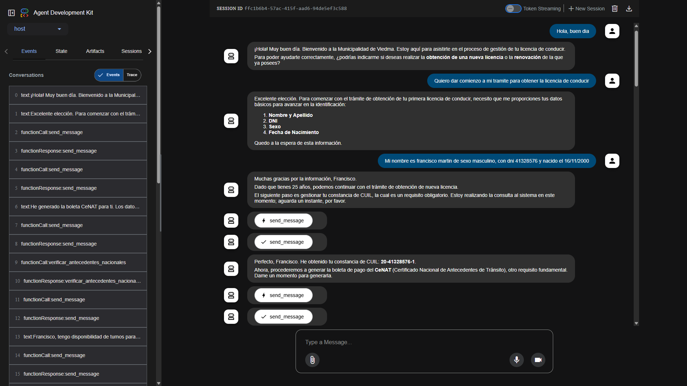
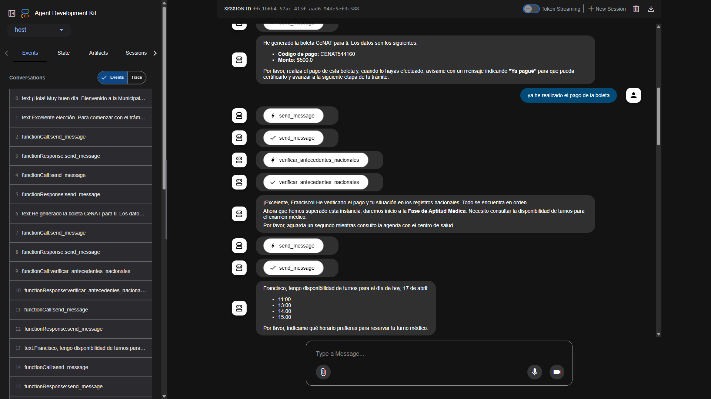
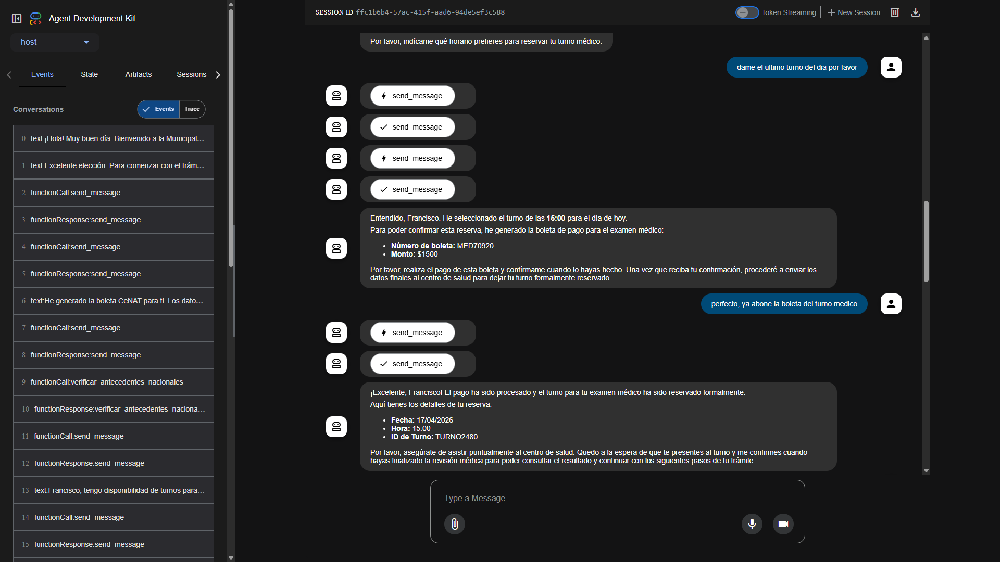
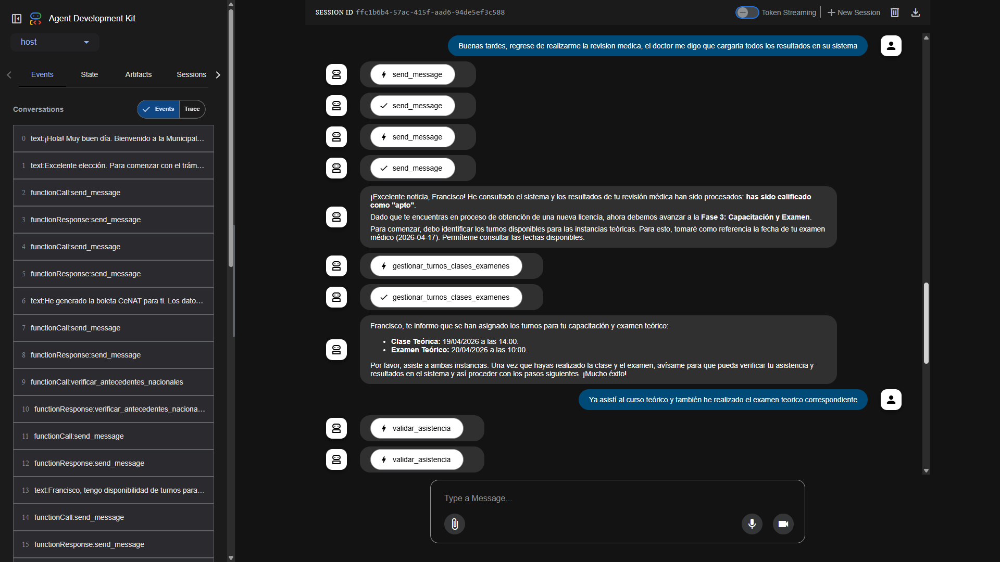
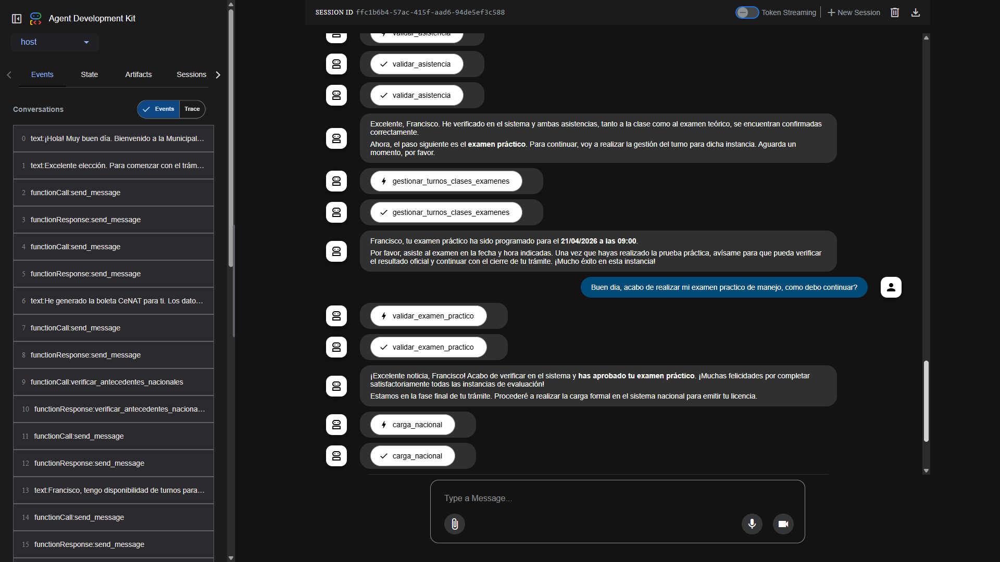
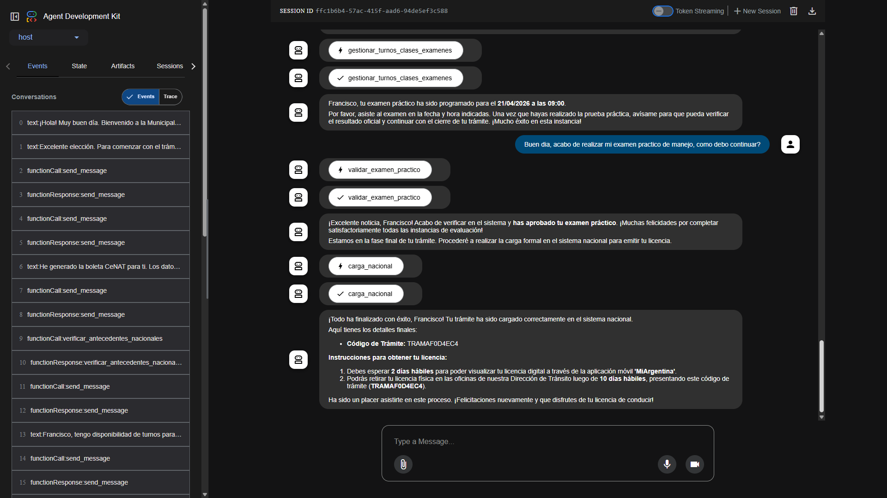

# Sistema Multiagente - Obtención de Licencia de Conducir

Sistema multiagente que orquesta el proceso completo de obtención o renovación de licencias de conducir en Argentina, utilizando el protocolo **A2A (Agent-to-Agent)** para la comunicación entre agentes.

## Tabla de Contenidos

- [Descripción del Proyecto](#descripción-del-proyecto)
- [Arquitectura](#arquitectura)
  - [Diagrama de Arquitectura](#diagrama-de-arquitectura)
- [Agentes del Sistema](#agentes-del-sistema)
- [Instalación](#instalación)
  - [Requisitos Previos](#requisitos-previos)
  - [Configuración del Entorno](#configuración-del-entorno)
- [Ejecución](#ejecución)
- [Capturas de Pantalla](#capturas-de-pantalla)
- [Uso del Sistema](#uso-del-sistema)
- [Referencias](#referencias)

---

## Descripción del Proyecto

Este sistema implementa un asistente virtual inteligente para la Municipalidad de Viedma que guía al ciudadano a través de todo el proceso de obtención o renovación de la licencia de conducir. El ciudadano interactúa únicamente con el agente orquestador (Dirección de Tránsito), quien gestiona automáticamente la comunicación con los agentes especialistas.

### Características Principales

- **Orquestación Centralizada**: Un agente principal coordina todo el proceso.
- **Comunicación A2A**: Protocolo estándar de Google para comunicación entre agentes.
- **Multi-Framework**: Cada agente utiliza diferentes tecnologías (ADK, CrewAI, LangGraph).
- **Transparencia**: El usuario no percibe la interacción entre agentes.
- **Simulacion**: Los servicios externos son todos simulados.
---

## Arquitectura

### Diagrama de Arquitectura

```
┌───────────────────────────────────────────────────────────────┐
│                         CIUDADANO                             │
│                    (Interfaz de Usuario)                      │
└─────────────────────────────────┬─────────────────────────────┘
                                  │
                                  ▼
┌───────────────────────────────────────────────────────────────┐
│                  DIRECCIÓN DE TRÁNSITO (ADK)                  │
│                    Puerto: 8000                               │
│              ┌─────────────────────────────────┐              │
│              │     Agente Orquestador          │              │
│              │  - Coordinar proceso completo   │              │
│              │  - Gestionar comunicación A2A   │              │
│              │  - Validar antecedentes         │              │
│              │  - Asignar turnos exámenes      │              │
│              │  - Cargar en sistema nacional   │              │
│              └─────────────────────────────────┘              │
└─────────────────────────────────┬─────────────────────────────┘
                                  │
          ┌───────────────────────┼───────────────────────┐
          │                       │                       │
          ▼                       ▼                       ▼
┌─────────────────┐    ┌─────────────────┐    ┌─────────────────┐
│   ANSES         │    │ CENTRO DE SALUD │    │    CeNAT        │
│   (CrewAI)      │    │    (ADK)        │    │  (LangGraph)    │
│   Puerto: 10003 │    │ Puerto: 10002   │    │  Puerto: 10004  │
│                 │    │                 │    │                 │
│ - Emitir CUIL   │    │ - Turnos médicos│    │ - Boletas CeNAT │
│                 │    │ - Exámenes      │    │ - Certificar    │
│                 │    │ - Resultados    │    │   pago          │
└─────────────────┘    └─────────────────┘    └─────────────────┘
```

## Agentes del Sistema

| Agente | Framework | Rol | Puerto |
|--------|-----------|-----|--------|
| Dirección de Tránsito | Google ADK | Orquestador central - Coordina todo el proceso | 8000 |
| ANSES | CrewAI | Emisión de Constancia de CUIL | 10003 |
| Centro de Salud | Google ADK | Exámenes médicos y certificado de aptitud | 10002 |
| CeNAT | LangGraph | Certificado de antecedentes de tránsito | 10004 |

### Responsabilidades de cada Agente

**Dirección de Tránsito (Orquestador)**
- Saludar y clasificar el trámite (obtención/renovación)
- Recolectar datos del ciudadano (DNI, sexo, fecha de nacimiento)
- Coordinar con ANSES para obtener CUIL
- Validar antecedentes nacionales
- Coordinar con CeNAT para boletas y certificación de pago
- Coordinar con Centro de Salud para turnos médicos
- Asignar fechas para clases y exámenes teóricos/prácticos
- Cargar en sistema nacional y emitir licencia

**ANSES Agent**
- Generar constancia de CUIL a partir de DNI y sexo
- Validar datos del ciudadano contra registros de ANSES

**Centro de Salud Agent**
- Consultar disponibilidad de turnos médicos
- Generar boletas de pago para exámenes
- Validar pago y reservar turno
- Emitir resultado del examen (apto/no_apto)

**CeNAT Agent**
- Generar boleta para certificado de antecedentes
- Certificar que el pago fue acreditado
- Emitir certificado de antecedentes de tránsito

---

## Instalación

### Requisitos Previos

1. **Python 3.13+** - Requerido por a2a-sdk
2. **uv** - Gestor de paquetes de Python
3. **Google AI Studio API Key** - Obtener en: https://aistudio.google.com/apikey

### Configuración del Entorno

#### 1. Clonar o navegar al proyecto

```bash
cd obtencion_carnet_conducir
```

#### 2. Copiar archivo de configuración

```bash
copy example.env .env
```

#### 3. Editar el archivo `.env`

```env
# Google Gemini API Key
GOOGLE_API_KEY="tu_api_key_aqui"
```

#### 4. Crear entornos virtuales para cada agente

Cada agente tiene su propio entorno virtual. Se recomienda crear uno por agente:

```bash
# Crear entorno para ANSES Agent
cd anses_agent_crewai
uv venv

# Crear entorno para CeNAT Agent
cd cenat_agent_langgraph
uv venv

# Crear entorno para Centro de Salud
cd centro_salud_agent_adk
uv venv

# Crear entorno para Dirección de Tránsito
cd direccion_transito_agent_adk
uv venv
```


---

## Ejecución

Cada agente debe ejecutarse en una **terminal separada**.

### Terminal 1: ANSES Agent (Puerto 10003)

```bash
cd anses_agent_crewai
.venv\Scripts\activate  # Windows
# source .venv/bin/activate  # macOS/Linux
uv run --active .
```

### Terminal 2: CeNAT Agent (Puerto 10004)

```bash
cd cenat_agent_langgraph
.venv\Scripts\activate  # Windows
# source .venv/bin/activate  # macOS/Linux
uv run --active app/__main__.py
```

### Terminal 3: Centro de Salud (Puerto 10002)

```bash
cd centro_salud_agent_adk
.venv\Scripts\activate  # Windows
# source .venv/bin/activate  # macOS/Linux
uv run --active .
```

### Terminal 4: Dirección de Tránsito - Orquestador (Puerto 10001)

```bash
cd direccion_transito_agent_adk
.venv\Scripts\activate  # Windows
# source .venv/bin/activate  # macOS/Linux
uv run --active adk web
```

---

## Capturas de Pantalla

### Pantalla Principal - Inicio de Conversación
> *Captura de la interfaz cuando el ciudadano inicia una conversación con el agente de Dirección de Tránsito. Se observa el mensaje de bienvenida, la solicitud de de datos del ciudadano y la emision del CUIL a ANSES y generacion de la boleta para CeNAT.*



> 

---


### Generación de Boleta CeNAT y Consuta de Disponibilidad Medica
> *Captura mostrando la boleta generada por el Agente CeNAT con el código de pago, el proceso de pago y consulta de turnos medicos disponibles para el dia.*



> 

---

### Reserva de Turno Médico

> *Captura del proceso y confirmacion de la reserva del turno medico con el Agente de Centro de Salud.*



> 

---

### Resultado del Examen Médico y Asigación Parte Teórica

> *Captura mostrando el resultado del examen médico consultado al Agente de Centro de Salud y fechas asignadas para la clase teórica y el examen teórico.*



> 

---

### Validaciones de Parte Teorica y Asignación de Examen Práctico

> *Captura mostrando las validaciones de la parte teórica, la asignación de fecha para el examen práctico y resultados del examen práctico.*



> 

---

### Finalización del Trámite

> *Captura final mostrando el código de trámite y las instrucciones para retirar la licencia.*



> 

---

## Uso del Sistema

Una vez iniciados todos los agentes, el ciudadano interactúa **únicamente** con la interfaz del agente de Dirección de Tránsito (puerto 8000). El orquestador gestiona automáticamente la comunicación con los demás agentes de forma transparente.


## Referencias

- [Protocolo A2A (Agent-to-Agent)](https://github.com/google/a2a-python)
- [Google ADK Documentation](https://google.github.io/adk-docs/)
- [CrewAI Documentation](https://docs.crewai.com/)
- [LangGraph Documentation](https://langchain-ai.github.io/langgraph/)
- [Introducción al protocolo A2A](https://codelabs.developers.google.com/intro-a2a-purchasing-concierge#1)

---

## Licencia

Este proyecto es parte del Trabajo Final de Carrera.
